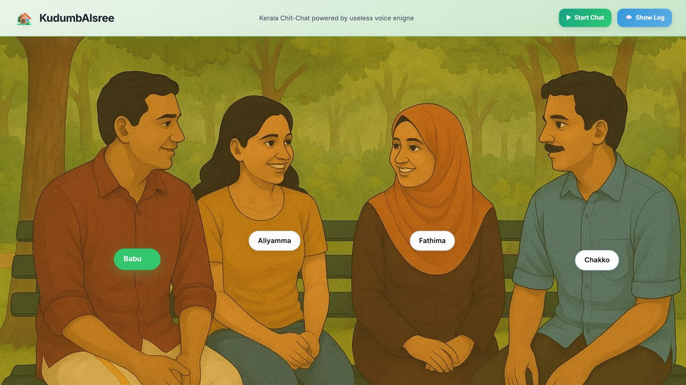
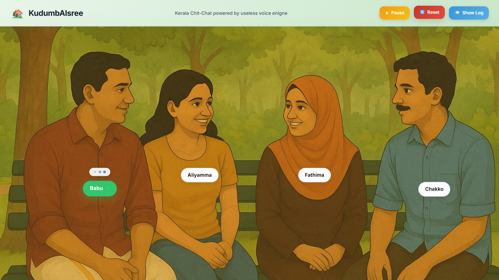
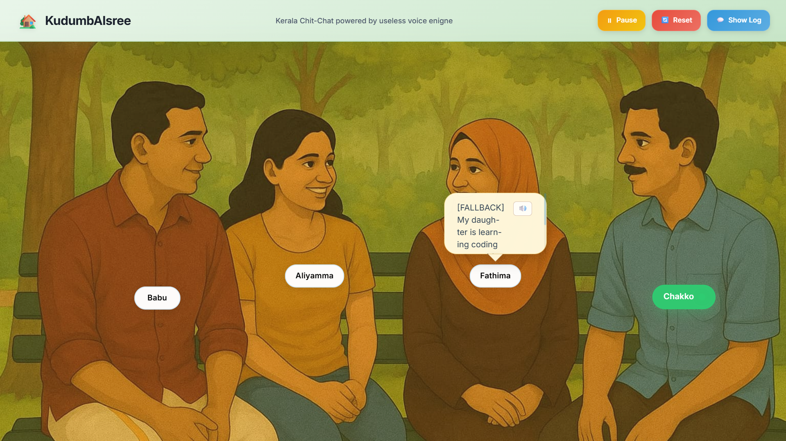

# [Project Name] 🎯


## Basic Details
### Team Name: Icarus 


### Team Members
- Team Lead: Deeraj P Menon - SOE,CUSAT
- Member 2: Hithek Siva - SOE,CUSAT


### Project Description
KudumbAISree is an interactive AI-powered conversation simulator that brings kerala style paradushanam to life .Experience a chit-chat conversations with AI characters like Aliyamma, Chako, Babu, and Fathima, complete with character-specific English voices and a useless voice engine.

### The Problem (that doesn't exist)
Ever found yourself desperately wanting to eavesdrop on your neighbors' conversations but can't because they're too quiet? Tired of missing out on juicy gossip because people stopped talking when you walked by? Suffering from chronic FOMO about what Kerala aunties and uncles discuss during their evening sit-outs? We've got you covered!

### The Solution (that nobody asked for)
Introducing KudumbAISree - your personal Kerala family drama generator! We've trained AI to become the ultimate gossip aunties and uncles, complete with authentic paradushanam skills. Just sit back, relax, and let Aliyamma, Chako, Babu, and Fathima spill all the tea (literally and figuratively) while you pretend to mind your own business. It's like having a front-row seat to every neighborhood drama without the awkwardness of actually being caught listening!

## Technical Details
### Technologies/Components Used
For Software:
- TypeScript - Main programming language for type-safe development
- React - Frontend framework for building the interactive UI
- Next.js - Full-stack React framework for production deployment
- Google Gemini 1.5 Flash API - AI model for generating character conversations
- Web Speech API - Browser-native text-to-speech synthesis
- Tailwind CSS - Utility-first CSS framework for styling
- Vercel AI SDK - Integration toolkit for AI services

For Hardware:
- Any modern web browser with Web Speech API support
- Audio output device (speakers/headphones)
- Internet connection for AI API calls

### Implementation
For Software:
# Installation
```bash
# Clone the repository
git clone https://github.com/Deratheone/kudumbAIsree.git
cd kudumbAIsree

# Install dependencies
npm install

# Set up environment variables
# Create .env.local file and add your Google API keys:
# GOOGLE_API_KEY_1=your_api_key_1
# GOOGLE_API_KEY_2=your_api_key_2
# GOOGLE_API_KEY_3=your_api_key_3
# GOOGLE_API_KEY_4=your_api_key_4
# GOOGLE_API_KEY_5=your_api_key_5
# GOOGLE_API_KEY_6=your_api_key_6
```

# Run
```bash
# Start the development server
npm run dev

# Open your browser and navigate to http://localhost:3000
# Ensure your browser supports Web Speech API for voice features
```

### Project Documentation
For Software:

# Screenshots (Add at least 3)

*KudumbAISree interface*


*AI speech loading*


*AI speech and voice output*

# Diagrams

*Add caption explaining your workflow*

### Project Demo
# Video
[Add your demo video link here]
*Explain what the video demonstrates*

# Additional Demos
[Add any extra demo materials/links]

## Team Contributions
- Deeraj P Menon: frontend
- Hithek Siva: backend and AI integration

---
Made with ❤️ at TinkerHub Useless Projects 


